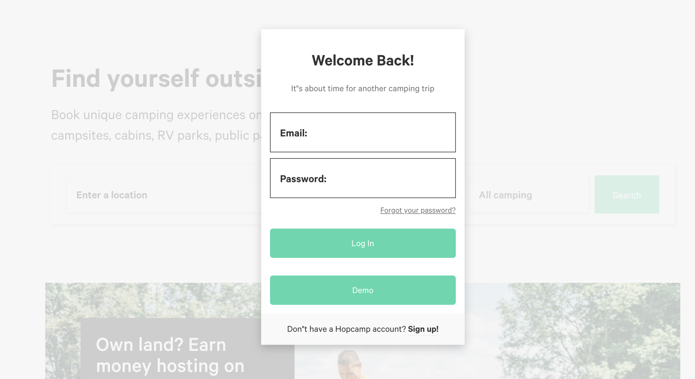
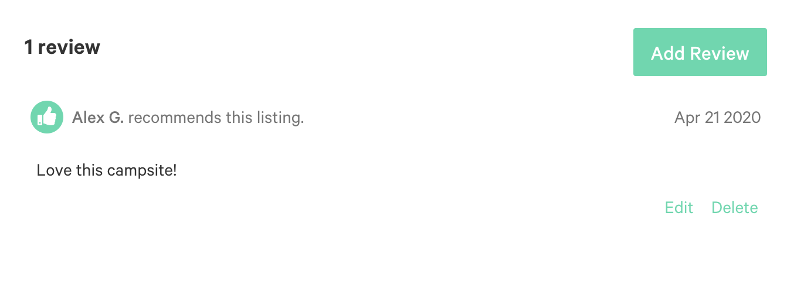

 # [Hopcamp](https://hopcamp.herokuapp.com) 


*A campsite booking web application inspired by Hipcamp, built with Ruby on Rails, React and Redux.*
[Live Demo](https://hopcamp.herokuapp.com) 

## Technologies

* PostgreSQL
* Ruby on Rails
* React.js
* Redux.js
* AJAX
* Google Maps API
* AWS S3
* Heroku
* HTML
* SCSS

## Code
Querying OpenWeatherMapsAPI from Rails 
```
    def weather_api
        response = Excon.get("http://api.openweathermap.org/data/2.5/weather?lat=#{self.lat}&lon=#{self.lng}&appid=#{ENV['WEATHER_API_KEY']}&units=imperial")
        return nil if response.status != 200
        result = JSON.parse(response.body)
        result = {weather: result["weather"].first["main"], temperature: result["main"]["temp"]}
    end
```
Custom geolocation based SQL query
```
    def self.in_bounds(bounds)
        campsites = Campsite
                    .where('lat BETWEEN ? AND ?', bounds["southWest"]["lat"],bounds["northEast"]["lat"])
                    .where('lng BETWEEN ? AND ?', bounds["southWest"]["lng"],bounds["northEast"]["lng"])
        return campsites
    end
```
Google Maps API(Places search, autocomplete and geocoder)
Once a search result is retreived, it will pass the coordinates to the url, so that the map component can set the center position according to query parameters.
```
 searchBox.addListener('place_changed', function () {
            var place = searchBox.getPlace();
            if (place.length == 0) {
                return;
            }
            if (!place.geometry) {
                const service = new google.maps.places.AutocompleteService();
                const geocoder = new google.maps.Geocoder();
                service.getPlacePredictions({input: that.state.input}, (res, status) => {
                  that.setState({input: res[0].description})
                  geocoder.geocode({ 'address': res[0].description }, (result, status) => {
                    if (status === 'OK') {
                      const [lat, lng]= [result[0].geometry.location.lat(), result[0].geometry.location.lng()]
                      const location = result[0].formatted_address
                      that.props.updateLocation({ location, lat, lng });
                      that.props.history.replace(`/search?lat=${lat}&lng=${lng}`)
                    }
                    else {
                      window.alert(status);
                    }
                  })
                })
            }
            else{
              const lat = place.geometry.location.lat()
              const lng = place.geometry.location.lng()
              const location = place.formatted_address
              that.props.updateLocation({location, lat, lng});
              that.props.history.replace(`/search?lat=${lat}&lng=${lng}`)
            }
            that.setState({ input: "" })
        })
```
React Hook tab features for Booking UI
```
  const handleCheckOut = (e) => {
    e.preventDefault();
    dispatch(createBooking(booking))
      .then(() => setTab("finish"))
      .fail((err) => dispatch(receiveErrors(err.responseJSON)))
  };

  const handleConfirm = (e) => {
    e.preventDefault();
    dispatch(clearErrors());
    setTab("booking");
  }
```
## Features
Search & Filter 


**User Auth**


**Campsite Booking**

*Utilised React-Day-Picker library to disabled user from making overlapping booking on the form input*


**Campsite Search**

*Incorporated Google Maps API to autocomple search query, retreive location information and search campsites.*


**Campsite Show**


**Campsite Review**

*Implemented RESTful API for CRUD cycle of reviews.* 



